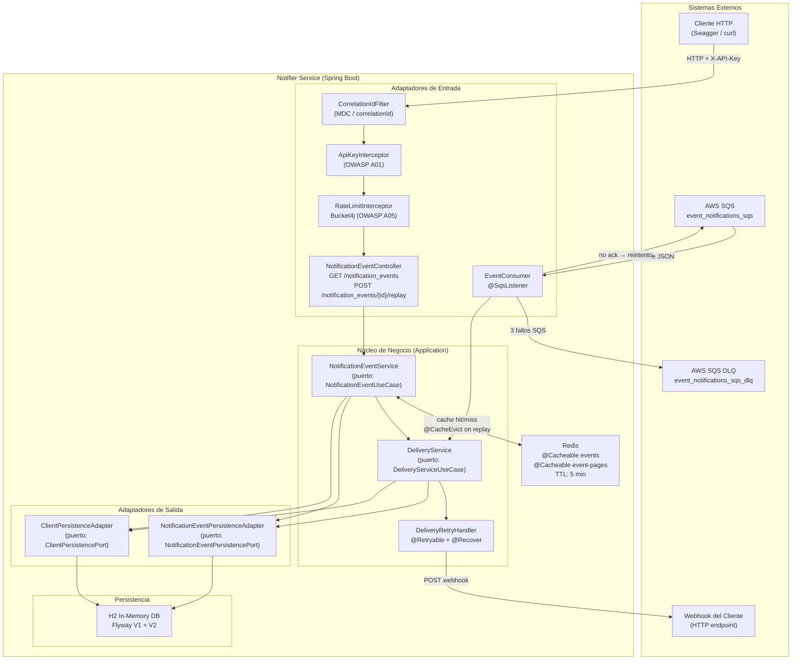
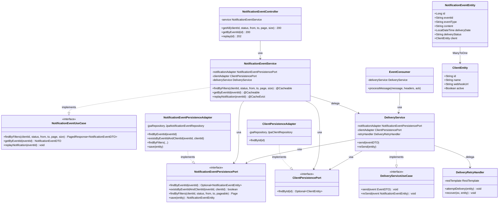
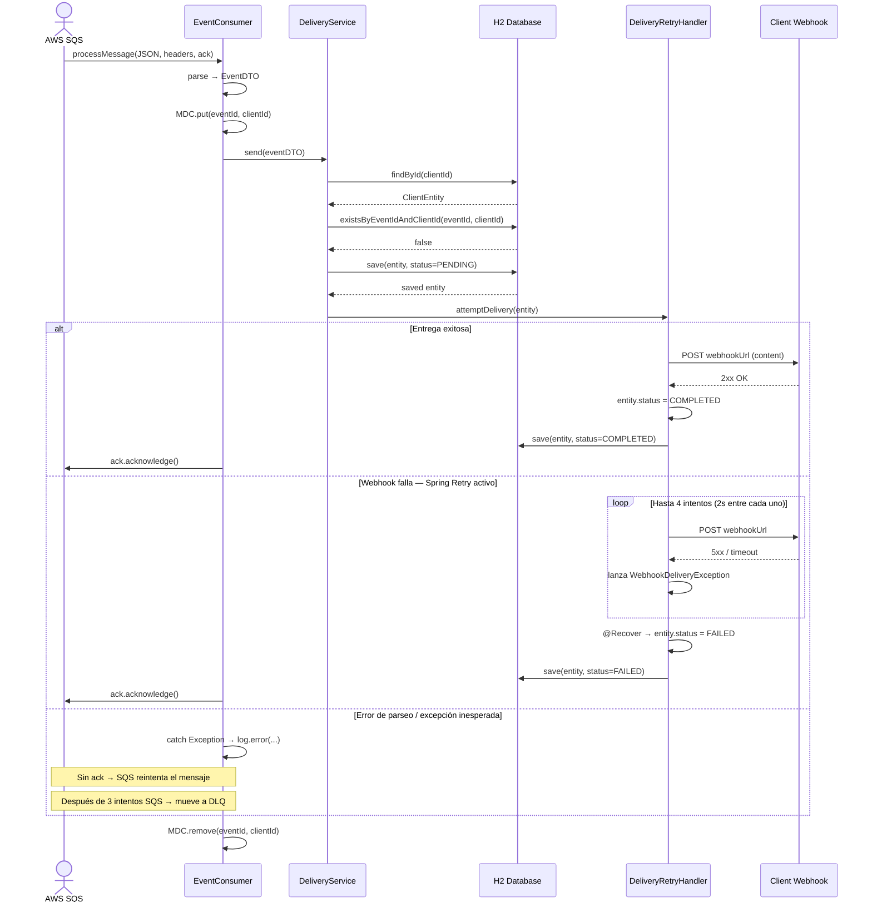
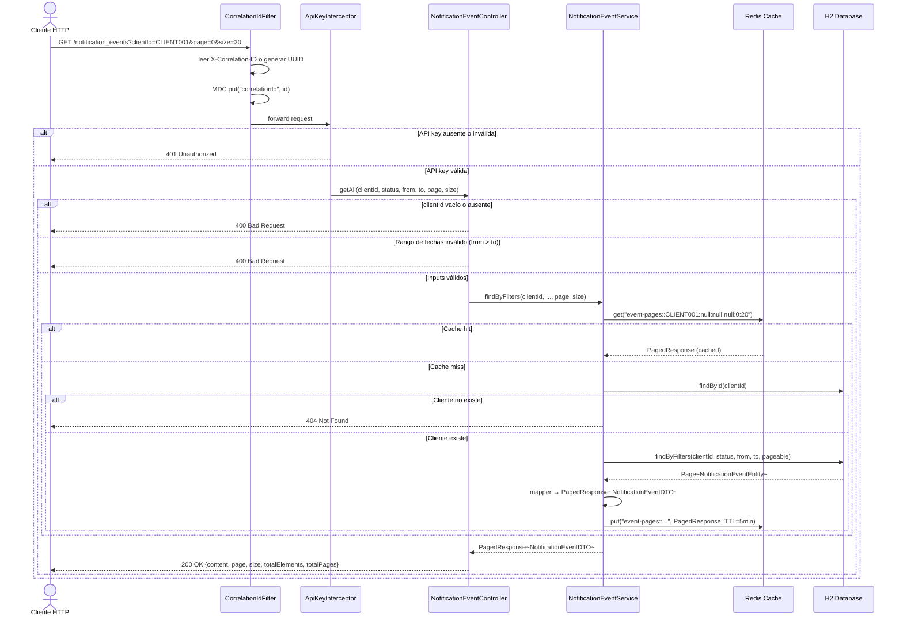
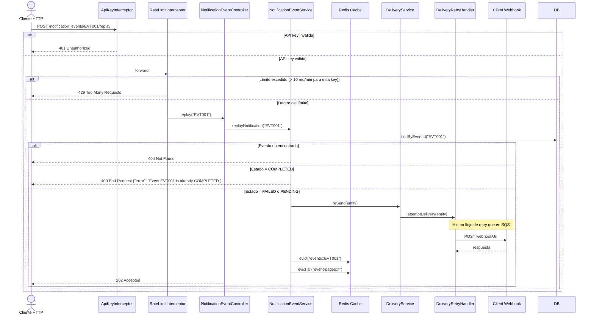

# Diagrams — Notifier Event API

---

## 1. System Overview

```
                        ┌────────────────────────────────────────────────────────────┐
                        │                     Notifier Service                       │
                        │                                                            │
  ┌──────────┐  JSON    │  ┌────────────────┐    ┌──────────────────────────────┐   │
  │   SQS    │─────────▶│  │  EventConsumer │───▶│       DeliveryService        │   │
  │(LocalSt.)│          │  │ (in/consumer)  │    │   (application/service)      │   │
  └──────────┘          │  └────────────────┘    └──────────────┬───────────────┘   │
                        │                                       │                   │
  ┌──────────┐  HTTP    │  ┌─────────────────────────────┐      │   save/lookup     │
  │  Client  │─────────▶│  │  NotificationEventCtrl      │      ▼                   │
  │ (Swagger │          │  │    ApiKeyInterceptor         │  ┌──────────────────┐   │
  │  / curl) │          │  │   RateLimitInterceptor       │  │   H2 In-Memory   │   │
  └──────────┘          │  │   CorrelationIdFilter        │  │    Database      │   │
                        │  │   GlobalExceptionHandler     │  │  (Flyway V1+V2)  │   │
                        │  └──────────────┬───────────────┘  └──────────────────┘   │
                        │                 │                                          │
                        │                 ▼                  ┌──────────────────┐   │
                        │  ┌──────────────────────────────┐  │      Redis       │   │
                        │  │   NotificationEventService   │◀▶│  (Cache 5 min)   │   │
                        │  │  @Cacheable / @CacheEvict    │  │   port 6379      │   │
                        │  └──────────────────────────────┘  └──────────────────┘   │
                        │                 │                                          │
                        │                 └──────── webhook POST ──▶ Client Webhook  │
                        └────────────────────────────────────────────────────────────┘
```

---

## 2. Package Structure (Hexagonal Architecture)

```
com.delmoralcristian.notifier
│
├── application/
│   ├── dto/                       # Data transfer objects
│   ├── port/
│   │   ├── in/                    # Use-case interfaces (input ports)
│   │   └── out/                   # Repository interfaces (output ports)
│   └── service/                   # Business logic
│       ├── NotificationEventService
│       ├── DeliveryService
│       └── DeliveryRetryHandler   # @Retryable + @Recover
│
├── infrastructure/
│   └── adapter/
│       ├── in/
│       │   ├── consumer/          # SQS listener (EventConsumer)
│       │   └── web/               # REST controller + security filters
│       └── out/
│           ├── mapper/            # MapStruct entity <-> DTO
│           └── persistence/       # JPA entities, repositories, adapters
│
├── config/                        # Spring configuration beans
├── advice/                        # AOP: @RestControllerAdvice, @TrackProcessingTime
├── enums/                         # EEventType, ENotificationStatus
└── exceptions/                    # WebhookDeliveryException
```

---

## 3. Architecture Diagram

Arquitectura hexagonal (Ports & Adapters) con dos canales de entrada: SQS y REST.



---

## 4. Class Diagram

Relaciones entre los componentes principales siguiendo el patrón Puertos y Adaptadores.



---

## 5. Sequence Diagram — SQS Event Ingestion

Flujo completo desde que SQS entrega el mensaje hasta la entrega al webhook del cliente, incluyendo retry y DLQ.



---

## 6. Sequence Diagram — GET /notification_events

Consulta paginada con autenticación, validación de inputs y cache Redis.



---

## 7. Sequence Diagram — POST /notification_events/{id}/replay

Reintento manual de entrega con rate limiting, validación de estado y evicción de cache.


